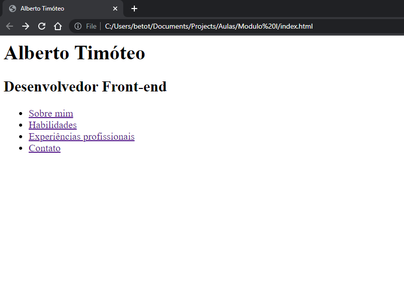
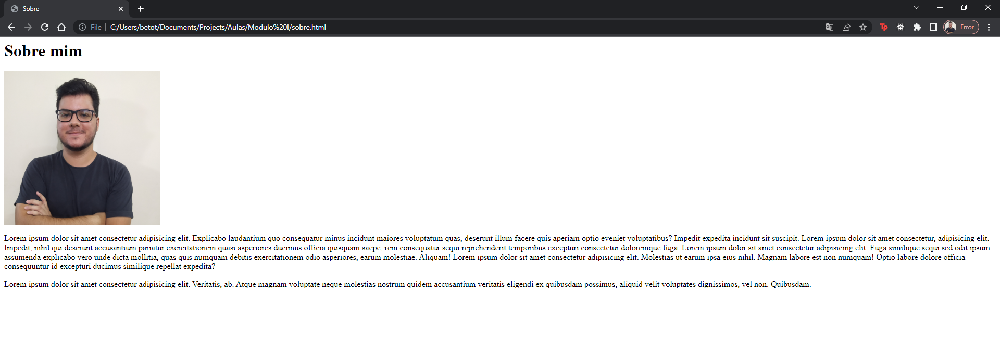
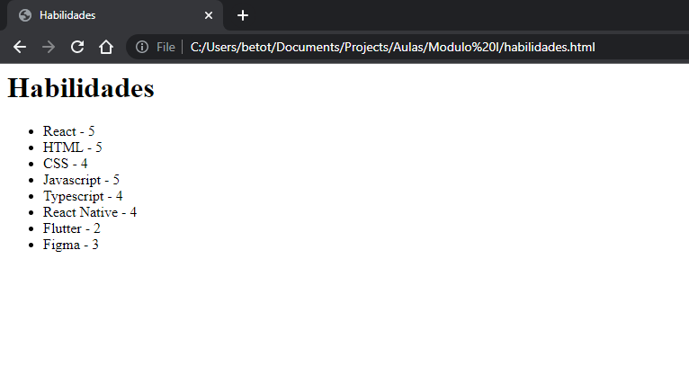
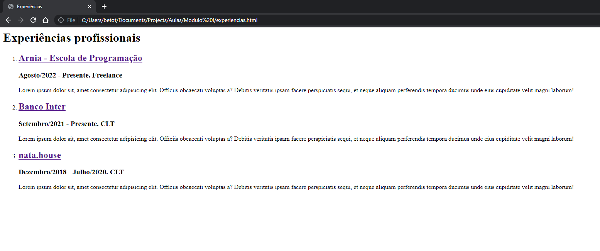
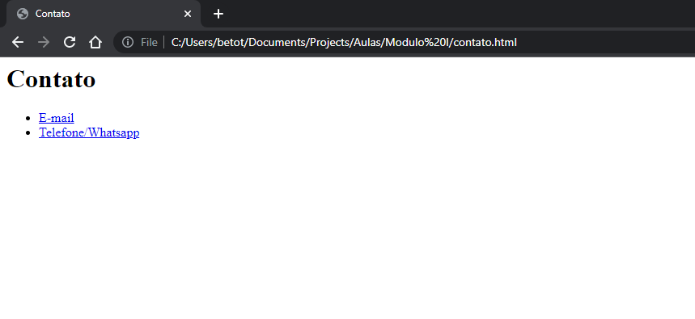

## Instruções do exercício:

Desenvolva um site HTML que será o seu site pessoal.
Este site deverá conter 5 páginas
1. Página inicial
2. Sobre mim 
3. Habilidades
4. Experiências profissionais
5. Contato

- A página inicial deverá ter links para as demais páginas.
- A página sobre mim deverá ter um título com o nome da página e um parágrafo com uma descrição sobre você.
- A página habilidades deverá ter uma lista não ordenada que vai listar as suas habilidades (tente colocar habilidades que você ainda irá adquirir no curso). Junto a esta habilidade, também deverá ter um nível de 1 a 5 em que essa habilidade se encontra.
- A página experiências profissionais deverá ter o seu currículo de atividades profissionais e acadêmicas (não se esqueça de incluir a Arnia, ein!) em uma lista ordenada. Separe em duas seções diferentes as profissionais das acadêmicas
- A página de contato deverá possuir links para contato com você, como e-mail e telefone.

### Dicas
1. Para fazer navegação entre as páginas, utilize o ```<a href="nomedapagina.html">```
2. Adicione a tag ```<meta charset="utf-8" />``` dentro do head, para que seus acentos não quebrem.
3. Cada página será um documento HTML separado.
4. Tente também adicionar uma imagem na página de sobre você. Lembre-se de ajustar o tamanho da imagem para caber bem na tela.
5. Na tela de contato lembre-se de usar o mailto: e o tel: para identificar que os valores são de telefone ou e-mail.
6. Futuramente nós vamos continuar esse projeto, deixando-o mais bonito e funcional, então preencha-o com carinho.
7. A página inicial deve se chamar index.html.
8. Lembre-se de trocar os titles de cada página.
9. Na página de experiências profissionais, se possível, adicione links aos nomes das empresas.
10. Extra: Caso queira tentar, dê uma lida na documentação da tag ```<nav>``` para utilizá-la na página inicial.

### Imagens





